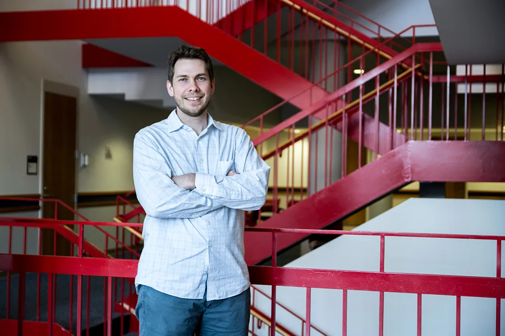
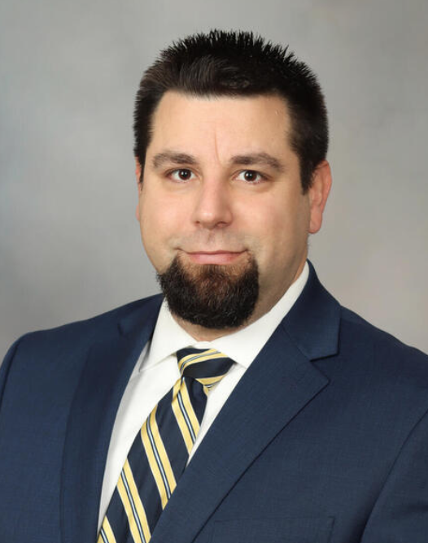



Education
======
* B.A. in Mathematics, University of Minnesota - Twin Cities, 2019
* Ph.D in Biomathematics, Bioinformatics, and Computational Biology, University of Minnesota - Twin Cities & Mayo Clinic College of Medicine and Sciences, 2023 (Expected)

<table>
<caption>Ph.D. Advisors</caption>
  <tr>
    <td style="text-align:center"><a href="https://www.mayo.edu/research/faculty/hart-steven-n-ph-d/bio-20124574">Steven N., Hart, Ph.D.</a></td>
    <td style="text-align:center"><a href="https://cse.umn.edu/cs/chad-myers">Chad L., Myers, Ph.D.</a></td>
  </tr>
  <tr>
    <td></td>
    <td></td>
  </tr>
</table>

<table>
<caption>Ph.D. Thesis Committee</caption>
  <tr>
    <td style="text-align:center"><a href="https://www.mayo.edu/research/faculty/hart-steven-n-ph-d/bio-20124574">Steven N., Hart, Ph.D.</a></td>
    <td style="text-align:center"><a href="https://www.mayo.edu/research/faculty/erickson-bradley-j-m-d-ph-d/bio-00077505">Bradley J., Erickson, M.D., Ph.D.</a></td>
    <td style="text-align:center"><a href="https://cse.umn.edu/cs/chad-myers">Chad L., Myers, Ph.D.</a></td>
    <td style="text-align:center"><a href="https://med.umn.edu/bio/obgyn-faculty/tim-starr">Timothy K., Starr, Ph.D.</a></td>
  </tr>
  <tr>
    <td></td>
    <td></td>
    <td></td>
    <td></td>
  </tr>
</table>

Award 
======
* Pathology Informatics 2021 Summit Trainee Award, 2021:
  * Association for Pathology Informatics
* Outstanding Poster Award at 2021 Mayo Clinic BMEP Annual Summer Research Symposium, 2021:
  * Department of Physiology and Biomedical Engineering, Mayo Clinic

Research Interests
=====
* Devising Artificial Intelligence (AI) Methods to Identify Anoamaly Regions from Whole Slide Images (WSIs)
* Identify Somatic Mutation Status Using Phenotypic Features from WSIs

Research Experience
======
* Ph.D. Candidate, Division of Computational Pathology & AI, Department of Laboratory Medicine and Pathology, Mayo Clinic, Fall 2019 - May 2023:
  * Deep Learning in Melanoma Pathology:
    * Build an unsupervised anomaly detection model to automatically segment abnormal skin histology
    * Develop supervised classification models to differentiate malignant melanoma from normal skin histology
    * Devise multi-class classification algorithms to predict the status of somatic mutations in commonly mutated
  melanoma genes

* Graduate Research Assistant, Division of Computational Pathology & AI, Department of Laboratory Medicine and Pathology, Mayo Clinic, Spring 2021 - Jan 2023:
  * Bacteria, Mycobacteria, and Fungi Detection from Whole Slide Images
    * Devising object detection algorithms to detect mycobacteria from AFB and Gram-stained WSIs
    * Devising object detection algorithms to detect fungi from GMS-stained WSIs
    * Deploying object detection algorithms into Sectra clinical diagnostic viewer to provide automatic annotation
  thumbnail image and assist pathologists’ diagnostics

* Graduate Research Assistant, Division of Computational Biology, Department of Quantitative Health Sciences, Mayo Clinic, Summer 2019 - Spring 2020:
  * Genomic Analytics R Shiny Application Development:
    * Genomics Analytics R Shiny App development
    * Develop R shiny application for Physician and Biologists to upload their own sequencing data and get their desired statistical analysis results from it

* Undergraduate Research Assistant, Department of Obstetrics, Gynecology and Women’s Health, University of Minnesota – Twin Cities, Winter 2016 - Winter 2017:
  * Survival Analysis Based on Colorectal Cancer Genetics:
    * Analyzed large datasets from The Cancer Genome Atlas Project (TCGA)
    * Using Python to generate a series of Kaplan-Meier survival curves to test the relationship between the survival rate and variabl (gene expression and gene mutation)
    * Used Log Rank to test the RNA expression levels of 20,000 different genes and mutations of RNA and protein expressions and used Cox Regression Model Selection to analyze the 60483 genes for 460 patients
    * Performed Wet Lab work:
      * Dissected mice for ShAPC, TCF and WAC gene and run PCR (for DNA) and Western blot (for protein)
      * Injected virus to mice to observe tumor change with Colonoscope
  
* Undergraduate Research Assistant, Department of Obstetrics, Gynecology and Women’s Health, University of Minnesota – Twin Cities, Spring 2017 - Spring 2018:
  * Gene Expression Patterns and K-M Curves:
    * Conducted literature review to introduce colon cancer, gene express and classification methods
    * Focused on the mutational hotspots of all colon cancer patients in three genes (BRAF codon 600, KRAS codon 12, 13 and 61, and PIK3CA codon 542, 545 and 1047)
    * Adopted ANOVA and genetic algorithm for feature selection to classify samples as mutated or wild type
    * Used kernel functions (linear, polynomial, radial base function and sigmoid) to run a model selection and decide the SVM parameters for each gene
    * Evaluated the classification performance for the different models with cross-validation
    * Recorded an excel table listing patients’ data for with columns of date of diagnosis, date of last visit, date of death, TP53 mutated and TP53 RNA level
    * Draw Kaplan-Meier survival curves based on high vs low expression of each gene based on RNA Sequence expression levels and calculated the p-value
    * Attempted to find the genes predicting overall survival and progression-free survival for colon cancer patients

* Undergraduate Research Assistant, Department of Mathematics, University of Minnesota – Twin Cities, Spring 2018:
  * Multi-grid algorithm in solving Partial Differential Equations (PDE):
    * Understand the basic Partial Differential Equations (PDE) and Probability Theorem
    * Understand the PDE Multigrid Algorithm with Jacobi and Poisson Distributions, compared the linear and nonlinear functions’ images processing with the multigrid Poisson iterations
    * Applied PDE and Probability Theorem in Imaging Analysis
    * MATLAB Programming used in Imaging Analysis and generated a research paper with LaTeX

Industry Experience
======
* Computational Pathology Ph.D. Level Summer Intern, Summer 2022:
  * Roche Diagnostics Solution (RDS)
  * Computational Science and Informatics (RDS CSI)
  * Computational Pathology Lab (CPL) Chapter

Mentoring Experience
======
* [PROJECT SHORT Pre-Grad Program Mentor](https://www.project-short.com/pre-grad-mentors/quincy-gu) , 2019 - Present:
  * Mentor undergradtaes for Ph.D. programs applications

Peer Reviewing Services
======
* Associate Editor & Reviewer, 2021 - Present:
  * [Journal of Emerging Investigators](https://emerginginvestigators.org)
* [Program Committee Member & Reviewer](https://www.miua2022.com), 2021 - 2022:
  * 2022 UK Conference on Medical Image Understanding and Analysis ([MIUA 2022](https://www.miua2022.com))

Skills
======
* Computational Technical Skills:
  * Artificial Intelligence
    * Machine Learning
      * Deep Learning
  * Computer Vision
  * Operating System:
    * Linux
  * Programming/Script Languages:
    * Python
    * MatLab
    * R
    * Bash
    * LaTex
    * C++
    * Go
    * Julia
    * Groovy
    * Swift
  * Cloud Computing:
    * Google Cloud Platform
    * Apache Beam Dataflow
  * Others:
    * Git
    * GitHub
    * Azure DevOps
* Languages:
  * Chinese
  * English

Professional Certifications
======
* Digital Pathology Certificate, National Society for Histotechnology
* Computational Genomics, University of Illinois Urbana-Champaign
* [AI for Medicine Specialization](https://www.coursera.org/account/accomplishments/specialization/8H37D84N6YW6?utm_source=mobile&utm_medium=certificate&utm_content=cert_image&utm_campaign=pdf_header_button), Deep Learning AI & Coursera
* [Deep Learning Specialization](https://www.coursera.org/account/accomplishments/specialization/LZ9BGXVNCYYW?utm_source=link&utm_medium=certificate&utm_content=cert_image&utm_campaign=social_icons&utm_user=ce4def3e6d1ab8728037afddcfac1456919839ea), Deep Learning AI & Coursera
* [Generative Adversarial Networks (GANs) Specialization](https://www.coursera.org/account/accomplishments/specialization/certificate/C7BAZTUEYFFK), Deep Learning AI & Coursera

Publications
======
  <ul>
    
  </ul>
  
Talks
======
  <ul>
    
  </ul>
  
Teaching
======
  <ul>
    
  </ul>
  
Professional Service and Leadership
======
* Education Committee Member, 2021 - 2022:
  * [National Society for Histotechnology](https://www.nsh.org/home)
